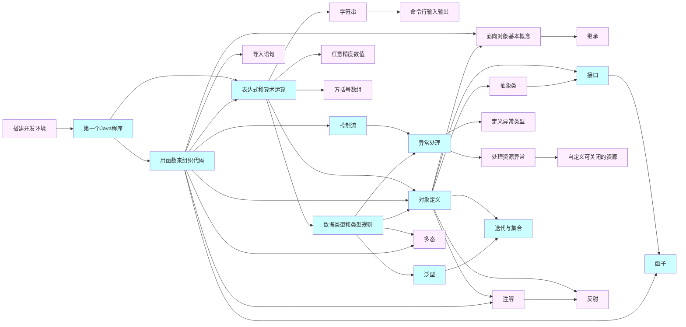

---
mermaid:true
---
# JAVA 讲义

创建一个仓库用来储存讲课的讲稿和代码。该讲义假设读者完成了C语言的学习。

看实际花费的时间扩大覆盖数据库的分公司。

感谢 @lijunlin2022 学长。仓库的地址在[https://github.com/jingkaimori/javaTutorial](https://github.com/jingkaimori/javaTutorial)

## 目录
1. 开发环境
    1. [搭建开发环境](./开发环境/开发环境.md)
    2. [编译并运行Java代码](./开发环境/第一个Java程序.md)
2. 基础语法
    1. [表达式与函数](./基础语法/02_表达式和函数.md)
        1. 嵌套的函数调用（暂缺）
        2. 函数定义（暂缺）
        3. 常用表达式
        4. 内置数值函数
    2. [数据类型](./基础语法/01_数据类型.md)
        1. [字符串](./基础语法/03_字符串.md)
    3. [控制流程](./基础语法/04_控制流程.md)
        1. 中断控制语句——break case;
        2. for each循环
    4. [命令行输入输出](./基础语法/05_输入输出.md)
        1. Scanner
3. 复杂的数据结构、类型和控制流
    1. [类与对象](./类型与对象/01_类与对象.md)
        1. 构造器（构造函数）
        2. this关键字
        3. [包 package](./类型与对象/02_package和import.md)
        4. 静态成员 static
        5. 访问控制
            1. public
            2. private
        6. JavaBean类
    2. [异常](./类型与对象/04_异常.md)
        1. throw与AutoClosable（暂缺）
        2. throw与Throwable（暂缺）
    3. [泛型](./类型与对象/08_泛型.md)
        1. 用泛型定义列表、集合和字典
        2. for each 遍历列表
    4. [注解](./类型与对象/09_注解.md)
    5. 函子（函数表达式）（暂缺）
    6. 集合与迭代器（暂缺）
        1. for each 遍历列表
4. [面向对象](./面向对象/01_什么是面向对象.md)
    1. [继承](./面向对象/03_继承.md)
    2. [抽象类](./面向对象/06_抽象类.md)
    3. [接口](./面向对象/07_接口.md)
    4. [多态](./面向对象/05_多态.md)
5. Java的多线程（暂缺）
    1. 创建线程
    2. 线程的执行权
        1. wait 和 notify 方法
    3. 数据竞争
    4. 未来量
    5. 锁
6. 其他数据类型
    1. [大数值](./其他数据类型/01_大数值.md)
    2. [数组和数组字面量](./其他数据类型/02_数组.md)
        1. 一维数组
        2. 嵌套数组或多维数组
7. Java的内置操作（暂缺）
    1. 文件读写
    2. 反射编程
8. Java还缺什么
    1. 全局变量（暂缺）
    2. 对象的序列化（暂缺）
9. 其他技术 
    1. [SQL语言](./数据库基本知识/SQL.md)
    1. JDBC 操作数据库
    2. AOP 面向切面编程
    3. Jackson 或 gson 以JSON格式转换对象
    4. Lombok 封装对象
    5. lwjgl 3D视频库

## 学习顺序

