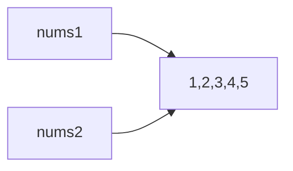
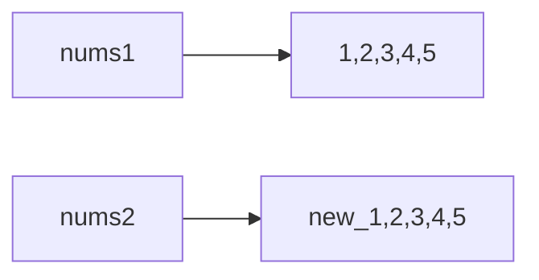

[TOC]

# 数组

在Java中，数组有两种声明方式：

```java
int a[];
int[] a;
```

java程序员一般习惯用第二种。

赋值方式基本与C语言一致，下面来看一个小例子：

```java
public class FirstSample {
    public static void main(String[] args) {
        int[] nums = {1, 2, 3, 4, 5};
        char[] chars = {'a', 'b', 'c', 'd', 'e'};
        for (int i = 0; i < nums.length; i++) {
            System.out.println(nums[i]);
        }
        for (int i = 0; i < chars.length; i++) {
            System.out.println(chars[i]);
        }
     }
}
```


## for each循环

废话不多说，直接开始代码：

```java
public class FirstSample {
    public static void main(String[] args) {

        int[] nums = {1, 2, 3, 4, 5};
        for (int e: nums) {
            System.out.println(e);
        }
     }
}
```

可以看到，for each循环，定义了一个变量e用来存储集合中的每一个元素，然后每次都输出e

for each循环的好处在于，不必要在担心下标的初始值以及终止值，推荐使用


## 数组拷贝

数组拷贝可以分为两种，借用C++的说法

* 浅拷贝
* 深拷贝

废话不多说，先看浅拷贝：

### 浅拷贝

直接利用等号进行拷贝

```java
public class FirstSample {
    public static void main(String[] args) {
        int[] nums1 = {1, 2, 3, 4, 5};
        int[] nums2 = nums1;
        nums2[4] = 21;
        for (int e : nums1) {
            System.out.println(e);
        }
        System.out.println("----------");
        for(int e : nums2) {
            System.out.println(e);
        }
     }
}
```

可以知道，浅拷贝生成的数组，与原数组指向同样的数组，其中一个改变也会带动另外一个改变



### 深拷贝

利用Array类的copyOf方法，代码如下：

```java
import java.util.Arrays;

public class FirstSample {
    public static void main(String[] args) {
        int[] nums1 = {1, 2, 3, 4, 5};
        int[] nums2 = Arrays.copyOf(nums1, nums1.length);
        nums2[4] = 21;
        for (int e : nums1) {
            System.out.println(e);
        }
        System.out.println("----------");
        for(int e : nums2) {
            System.out.println(e);
        }
     }
}
```

深拷贝创建了全新的数组，如下图所示：




## 命令行参数

每一个Java应用程序，都有一个带String args[]参数的main方法。这个参数表明main方法将接受一个字符串数组，我们称之为`命令行参数`

