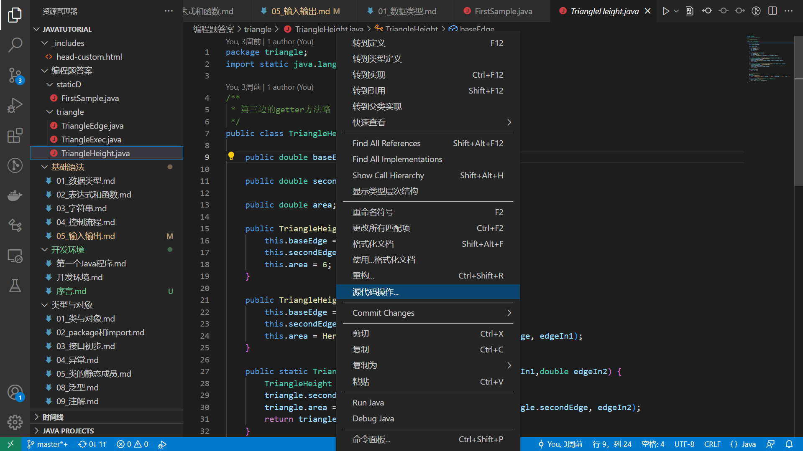
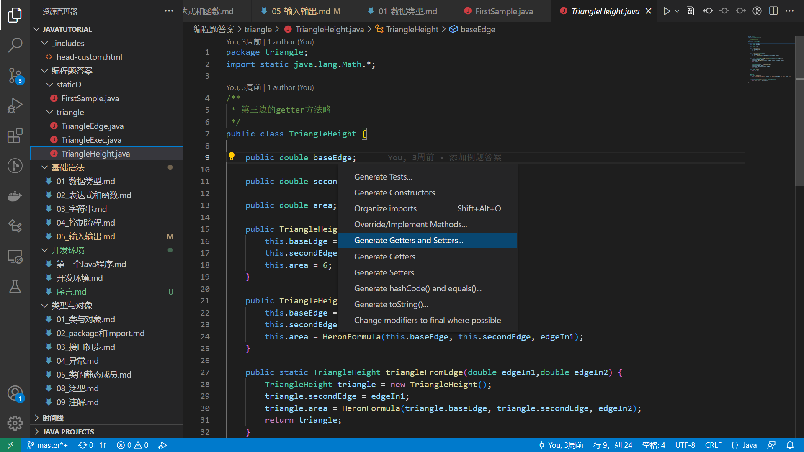

[TOC]

# 类与对象

前几节课，我们学到了如何使用变量，如何访问Java内置的数据结构，以及编写表达式，使用Java的静态方法。这些结构还不足以编制复杂的程序，我们来看下题：

> 写一个程序，保存一个人的信息，包括：
> 
> * name——姓名
> * age——年龄
> 
> 保存之后，可以通过调用程序来查询某个人的姓名，年龄等信息。

## 1.1 如何构造对象

### 用数组模拟对象

有的同学在C语言编程中，会用几个数组来表示复杂的数据：

```c
#include <stdio.h>

// storage 100 Person
char name[100][20]
int age[100]

void printName(size_t personID){
    printf("the name of student is %s\n", name[personID]);
}
// omit other functions
```

### C结构体实现对象

首先我用C语言写：

###### 代码1

```c
#include <stdio.h>
#include <string.h>
#include <stdlib.h>

struct Person {
    char name[20];
    int age;
};

void printName(struct Person p) {
    printf("the name of student is %s\n", p.name);
}

void printAge(struct Person p) {
    printf("the age of student is %d\n", p.age);
}

int main() {

    struct Person stu;

    printf("please enter the name of student\n");
    scanf("%s", stu.name);
    
    getchar();

    printf("please enter the age of student\n");
    scanf("%d", &stu.age);
    

    printf("what do you want to know? name or age\n");
    char command[10];

    scanf("%s", command);
    if(strcmp(command, "name") == 0) {
        printName(stu);
    }
    else {
        printAge(stu);
    }
    return 0;    
}

```

### Java的类定义

下面用Java来改写上方的程序：

###### 代码2

```java
import java.util.Scanner;

class Person {
    public String name;
    public int age;

    public Person(String name, int age) {
        //this指的是当前对象
        this.name = name;
        this.age = age;
    }

    public void printName() {
        System.out.println(this.name);
    }

    public void printAge() {
        System.out.println(this.age);
    }
}

public class FirstSample {

    public static void main(String[] args) {

        Scanner in = new Scanner(System.in);

        System.out.println("please enter the name of student");
        String name = in.nextLine();

        System.out.println("please enter the age of student");
        int age = in.nextInt();
        in.nextLine();

        Person stu = new Person(name, age);

        System.out.println("what do you want to know? name or age");
        String command = in.nextLine();

        if(command.equals("name")) {
            stu.printName();
        }
        else {
            stu.printAge();
        }

    }
}
```

查询信息的函数和对象的属性不需要一一对应，就上面的程序而言，可以添加查询出生年份的方法，而不需要添加相应的字段。本节课的习题将会提到这一点。

## 1.2 构造函数

注意观察上面的例子，C中创建对象只需要定义对应类型的变量，而Java还要用`new Person`来给出对象的初值。Java通过类定义创建对象时，需要对象中有一个构造函数（constructor）。构造函数也叫构造器，构造方法。

<font color="green">一般我们称类里面的函数叫做方法（method），而把类外面的函数叫做函数（function）</font>

构造器名与类名完全一致，无返回值，也不能用void表示返回值的类型。

构造器不能被直接调用，通常使用new关键字隐式调用。new 语句完成了两项任务，一项是分配存储空间，一项是调用构造器

### 构造函数的重载

下面的例子中，`Person`类有多个构造函数，这些函数有着不同的参数。new表达式可以带有不同的参数，而这些参数则匹配构造方法的形参列表，只有参数匹配的构造函数才会被调用。没有参数的时候，new调用的是无参构造方法。
下面我们再看多个参数的构造方法，注意这个例子中的构造函数重载：

###### 代码4

```java
import java.util.Scanner;

class Person {
    public String name;
    public int age;
    public String sex;

    public Person() {
        this.name = "ljl";
        this.age = 80;
    }

    public Person(String name, int age) {
        this.name = name;
        this.age = age;
        this.sex = "male";
    }

    public Person(String name, int age, String sex) {
        this.name = name;
        this.age = age;
        this.sex = sex;
    }

    public void printName() {
        System.out.println(this.name);
    }

    public void printAge() {
        System.out.println(this.age);
    }

    public void printSex() {
        System.out.println(this.sex);
    }
}

public class FirstSample {

    public static void main(String[] args) {

        Scanner in = new Scanner(System.in);

        String name = in.nextLine();
        int age = in.nextInt(); in.nextLine();
        String sex = in.nextLine();

        Person stu1 = new Person(name, age, sex);

        Person stu2 = new Person();
        stu2.name = name;
        stu2.age = age;
        stu2.sex = sex;


        Person stu3 = new Person(name, age);
        stu2.sex = sex;

        Person stu = stu1;
        System.out.println("what do you want to know? name , age or sex");
        String command = in.nextLine();

        if(command.equals("name")) {
            stu.printName();
        }
        else if(command.equals("age")){
            stu.printAge();
        }
        else {
            stu.printSex();
        }

    }
}
```


## 对象的生命周期

一个对象，生命周期包括创建、使用和销毁

这里我以C++作为一个例子：

###### 代码5

```c++
#include <iostream>
using namespace std;

class Person{
private:
    string name;
    int age;
public:
    Person(string n, int a) {
        this->name = name;
        this->age = age;
        cout << "Person Created" << endl;
    }
    ~Person() {
        cout << "Person Destory" << endl;
    }
};

int main() {
    string name;
    int age;
    cin >> name;
    cin >> age;
    Person* stu = new Person(name, age);
    delete stu;
    return 0;
}
```

与C++不同，Java内置垃圾回收机制。

如果C++程序没有缺陷，那么`delete`语句会立即调用析构函数并完成清理工作，这一动作肯定会执行；

Java的垃圾回收只与内存有关，Java里的对象并非一定会被垃圾回收。在对象不可访问后，Java内存空间中的对象不会立即被移除，而要等到垃圾回收（GC）时才会被清除。对象被清除前，JVM会执行对象的`finalize`方法，执行方法后还会等待其他对象重用原来的空间。只要垃圾回收不执行，那么与垃圾回收有关的任何行为（尤其是finalize()方法）都不会执行。而且Java没有`delete`语句这种立即删除对象并释放存储空间的操作，因此finalize()方法不能视为c++中的析构函数。

如果java想要实现类似c++析构函数的清理效果，必须编写恰当的清理方法，并明确调用，而不是依靠finalize()方法。后面我们会讲到AutoCloseable接口来实现这一点。

## 对象成员的作用域

简单解释 public 和 private，public 是公有的，类外面的函数可以访问到它private是私有的，类外面访问它会出错

比如之前代码四，我们也可以写成

###### 代码6

```java

        if(command.equals("name")) {
            System.out.println(stu.name);
        }
        else if(command.equals("age")){
            System.out.println(stu.sex);
        }
        else {
            System.out.println(stu.age);
        }

```

但是一般我们会将变量设为私有：

###### 代码7

```java
class Person {
    private String name;
    private int age;
    private String sex;
    ...
}
```

这种写法的好处之一是，如果想要我变量的值，只能通过我写好的函数，就不必担心变量什么时候不小心就被篡改了。

### JavaBean类

用私有变量来保存状态，而

我们之前已经自己写过了一些类。在实际应用中，有一种类非常常见，被称为JavaBean类。

现在我们使用VSC来生成JavaBean类，IDEA的操作大同小异。

鼠标右键，选择`源代码操作`（IDEA为generate）：



然后选择`Generate Constructor`，选择`Generate Getters and Setters`



可以看到，JavaBean类有下面这些特点：

* 类的属性为private型
* 提供getter和setter方法访问属性

## 1.3 this关键字

this的使用方法如下：

* 用this指对象本身
* 访问本类的成员，this.属性名，this.方法名()
* 调用本类的构造器：this(参数)

关于this关键字的由来，我这里写了一段C语言的程序，帮助大家理解：

###### 代码8

```c
#include <stdio.h>
#include <stdlib.h>

typedef struct person{
    char* p_name;
    int age;
    struct person* createPerson;
}Person;

Person* createPerson(char* p_name, int age) {
    Person* p_newPerson = (Person*)malloc(sizeof(Person));
    if(p_newPerson != NULL) {
        p_newPerson->p_name = p_name;
        p_newPerson->age = age;
    }
    return p_newPerson;
}

void printName(Person* p_this) {
    if(p_this != NULL) {
        printf("%s\n", p_this->p_name);
    }
}

void printAge(Person* p_this) {
    if(p_this != NULL) {
        printf("%d\n", p_this->age);
    }
}

int main() {

    char p_name[20];
    int age;
    scanf("%s", p_name);
    getchar();
    scanf("%d", &age);

    Person* stu = createPerson(p_name, age);

    printName(stu);
    printAge(stu);

    return 0;

}
```

可以看到，要取到对象中的变量，操作对象的函数就会有一个参数是这个对象（或其指针），而这个对象一般命名为this。后续的语言（C++，Java）中，隐藏了这个参数，因此不需要定义this参数，而直接用this来访问当前对象。而这也可以看成后续语言中this的由来。

## 综合应用
### 小题目

写一个三角形类`TriangleEdge`，要求在类中存储三角形的三边长度，并具有下述构造方法：

1. 无参构造函数：以3，4，5作为三角形的边长；
2. 一个数值参数： 两条边的边长分别为3和4，另一条边为输入参数；

并编写下述静态方法：

1. 两个数值参数：一条边边长为3，输入参数是其余两条边的边长；
2. 两个数值参数：一条边边长为3，输入参数是第二条边的边长和第三个顶点到已知的边长为3的点的距离，该函数只构造锐角三角形和直角三角形；

然后编写计算三角形的面积的方法。根据三角形的三边长来计算面积的公式是海伦公式:
$$S = \sqrt{p (p-a) (p-b) (p-c)}, p = \frac{a+b+c}{2}$$
而余弦定理如下：
$$ c^2 = a^2 + b^2 - 2ab\cos{C} $$
等价的代码如下：
```java
double HeronFormula(double a,double b,double c){
    double p= (a + b + c)/2;
    return sqrt(p * (p-a) * (p-b) * (p-c));
}
double CosineLaw(double a,double b,double Cangle){
    return sqrt(a*a + b*b - 2*a*b*Math.cos(Cangle));
}
```

#### （1）写出符合上述条件的类

#### （2）构造三角形时，判断输入能否构成三角形？

#### （3）假如用户不听你的话，输入的是字符，像A，B，"11"，C，D这样怎么办？

#### （选做4）如果输入的是超大型正数怎么办？

#### （选做5）将三角形面积类改写为JavaBean类，并写出读取三边长和面积的方法？

#### （选做6）定义另外一个类`TriangleHeight`，在类中存储：两条边的长度，和三角形的面积，给出该类的实现并完成上述各问。

三角形边长为3，4，5时，面积为6。对于重新构造的类而言，第三条边是对象里没有存储的边长。

#### （选做7）编写构造函数或静态方法，将`TriangleEdge`类的三角形转换为`TriangleHeight`类？

#### （思考8）对于上述两个类，能否分别写出修改三边长度的方法？能否写出修改面积的方法？

#### （思考9）能否在一个对象中，同时存储三边长和面积？此时如何修改三边长？

#### 题解与说明

本题的参考答案在[triangle](/编程题答案/triangle/)文件夹下。

类型定义不同、字段含义不同的对象，可以有相同的外部特征，写出相同的JavaBean类。

用户会通过键盘来输入各个参数，用户有可能提供任意类型的输入，必须检查任何用户输入。

如果某个对象的内部字段比定义这个对象的参数多，就会有字段约束，此时要通过修改方法（setter）来保证这一约束。
