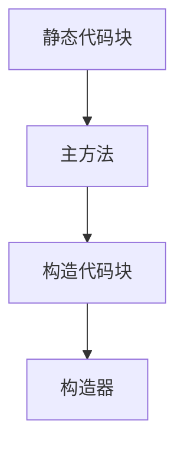

[TOC]

# 类与对象

题目：

写一个程序，保存一个人的信息，包括：

name——姓名

age——年龄

保存之后，可以通过输入指令name，age查询这个对应的信息。

## 1.1 从struct到class

首先我用C语言写：

###### 代码1

```c
#include <stdio.h>
#include <string.h>

struct Person {
    char name[20];
    int age;
};

void printName(struct Person p) {
    printf("the name of student is %s\n", p.name);
}

void printAge(struct Person p) {
    printf("the age of student is %d\n", p.age);
}

int main() {

    struct Person stu;

    printf("please enter the name of student\n");
    scanf("%s", stu.name);
    
    getchar();

    printf("please enter the age of student\n");
    scanf("%d", &stu.age);
    

    printf("what do you want to know? name or age\n");
    char command[10];

    scanf("%s", command);
    if(strcmp(command, "name") == 0) {
        printName(stu);
    }
    else {
        printAge(stu);
    }
    return 0;    
}

```

下面我用Java来写：

###### 代码2

```java
import java.util.Scanner;

class Person {
    public String name;
    public int age;

    public Person(String name, int age) {
        //this指的是当前对象
        this.name = name;
        this.age = age;
    }

    public void printName() {
        System.out.println(this.name);
    }

    public void printAge() {
        System.out.println(this.age);
    }
}

public class FirstSample {

    public static void main(String[] args) {

        Scanner in = new Scanner(System.in);

        System.out.println("please enter the name of student");
        String name = in.nextLine();

        System.out.println("please enter the age of student");
        int age = in.nextInt();
        in.nextLine();

        Person stu = new Person(name, age);

        System.out.println("what do you want to know? name or age");
        String command = in.nextLine();

        if(command.equals("name")) {
            stu.printName();
        }
        else {
            stu.printAge();
        }

    }
}
```

## 1.2 构造函数

Java创建通过类创建对象时，需要对象中有一个构造函数。或者叫构造器，构造方法。

<font color="green">一般我们称类里面的函数叫做方法，而把类外面的函数叫做函数</font>

> 构造器名与类名完全一致，无返回值，也不能用void表示返回值的类型。
>
> 构造器不能被显示调用，通常使用new关键字隐式调用
>
> 也就是说，new 完成了两项任务，一向是分配存储空间，一项是调用构造器


### 1.2.1 无参构造函数

###### 代码3

```java
import java.util.Scanner;

class Person {
    public String name;
    public int age;

    public Person() {
        this.name = "ljl";
        this.age = 80;
    }

    public Person(String name, int age) {
        this.name = name;
        this.age = age;
    }

    public void printName() {
        System.out.println(this.name);
    }

    public void printAge() {
        System.out.println(this.age);
    }
}

public class FirstSample {

    public static void main(String[] args) {

        Scanner in = new Scanner(System.in);
        Person stu = new Person();

        System.out.println("what do you want to know? name or age");
        String command = in.nextLine();

        if(command.equals("name")) {
            stu.printName();
        }
        else {
            stu.printAge();
        }

    }
}
```

这里我们看到，没有参数的时候，new调用的是无参构造方法

这种关系我们称之为**方法的重载**

> 一个类中可以有多个同名方法，其参数的个数和参数的类型不同，惩治为**方法的重载**


### 1.2.2 其他构造方法

下面我们再看多个参数：

###### 代码4

```java
import java.util.Scanner;

class Person {
    public String name;
    public int age;
    public String sex;

    public Person() {
        this.name = "ljl";
        this.age = 80;
    }

    public Person(String name, int age) {
        this.name = name;
        this.age = age;
        this.sex = "male";
    }

    public Person(String name, int age, String sex) {
        this.name = name;
        this.age = age;
        this.sex = sex;
    }

    public void printName() {
        System.out.println(this.name);
    }

    public void printAge() {
        System.out.println(this.age);
    }

    public void printSex() {
        System.out.println(this.sex);
    }
}

public class FirstSample {

    public static void main(String[] args) {

        Scanner in = new Scanner(System.in);

        String name = in.nextLine();
        int age = in.nextInt();
        in.nextLine();
        String sex = in.nextLine();

        Person stu = new Person(name, age, sex);

        System.out.println("what do you want to know? name , age or sex");
        String command = in.nextLine();

        if(command.equals("name")) {
            stu.printName();
        }
        else if(command.equals("age")){
            stu.printAge();
        }
        else {
            stu.printSex();
        }

    }
}
```


### 1.2.3 对象的生命周期

一个对象，生命周期包括创建、使用和销毁

这里我以C++作为一个例子：

###### 代码5

```c++
#include <iostream>
using namespace std;

class Person{
private:
    string name;
    int age;
public:
    Person(string n, int a) {
        this->name = name;
        this->age = age;
        cout << "Person Created" << endl;
    }
    ~Person() {
        cout << "Person Destory" << endl;
    }
};

int main() {
    string name;
    int age;
    cin >> name;
    cin >> age;
    Person* stu = new Person(name, age);
    delete stu;
    return 0;
}
```


Java的垃圾回收机制：

> java并没有提供析构函数或相似的概念，
>
> 代之以的垃圾回收机制，但是垃圾回收并不等同于“析构”，而作为垃圾回收机制的一部分，finalize()方法更不能视为c++中的析构函数。
>
> 这是因为：如果C++程序没有缺陷，那么析构函数会被自动调用并完成清理工作，这一动作是一定会执行的；
>
> 而java的垃圾回收只与内存有关，只要程序没有濒临存储空间耗尽，那么与垃圾回收有关的任何行为（尤其是finalize()方法）都不会执行，换言之，java里的对象并非一定会被垃圾回收！
>
> 进而，如果java想要实现类似c++析构函数的清理效果，必须编写恰当的清理方法，并明确调用，而不是依靠finalize()方法，


简单解释 public 和 private，public 是公有的，类外面的函数可以访问到它private是私有的，类外面访问它会出错

比如之前代码四，我们也可以写成

###### 代码6

```java

        if(command.equals("name")) {
            System.out.println(stu.name);
        }
        else if(command.equals("age")){
            System.out.println(stu.sex);
        }
        else {
            System.out.println(stu.age);
        }

```

但是一般我们会将变量设为私有：

###### 代码7

```java
class Person {
    private String name;
    private int age;
    private String sex;
    ...
}
```

这样的好处时，如果想要我变量的值，只能通过我写好的函数，就不必担心变量什么时候不小心就被篡改了


## 1.3 this关键字

this的使用方法如下：

* 用this指对象本身
* 访问本类的成员，this.属性名，this.方法名()
* 调用本类的构造器：this(参数）

关于this关键字的由来，我这里写了一段C语言的程序，帮助大家理解：

###### 代码8

```c
#include <stdio.h>
#include <stdlib.h>

typedef struct person{
    char* p_name;
    int age;
    struct person* createPerson;
}Person;

Person* createPerson(char* p_name, int age) {
    Person* p_newPerson = (Person*)malloc(sizeof(Person));
    if(p_newPerson != NULL) {
        p_newPerson->p_name = p_name;
        p_newPerson->age = age;
    }
    return p_newPerson;
}

void printName(Person* p_this) {
    if(p_this != NULL) {
        printf("%s\n", p_this->p_name);
    }
}

void printAge(Person* p_this) {
    if(p_this != NULL) {
        printf("%d\n", p_this->age);
    }
}

int main() {

    char p_name[20];
    int age;
    scanf("%s", p_name);
    getchar();
    scanf("%d", &age);

    Person* stu = createPerson(p_name, age);

    printName(stu);
    printAge(stu);

    return 0;

}
```

可以看到，要取到对象中的变量，C语言必须有一个this指针。而这也可以看成后续语言中this的由来。


## 1.4 JavaBean类

我们之前已经自己写过了一些类。在实际应用中，有一种类非常常见，被称为JavaBean类。现在我们使用IDEA来生成JavaBean类

鼠标右键，选择generate，然后选择constructor，


鼠标右键，选择generate，然后选择getter and setter


可以看到，JavaBean类有下面这些特点：

> 类的属性为private型
>
> 提供getter和setter方法访问属性


## 1.5 static

我们知道，Java的主函数，psvm 中有一个static，现在我们就来学习static关键字

static修饰的变量，称为静态变量，同样是来自于C语言

###### 代码9

```c
#include <stdio.h>

void f() {
    int j = 0;
    static int i = 1;
    i++;
    j++;
    printf("i=%d, j=%d\n", i, j);
}

int main() {
    f();
    f();
    return 0;
}
```

从执行结果来看，两次调用f()函数，j的值相同，而i的值不同。

这是因为静态变量在程序编译就被创建，且只被创建一次

而动态变量j在调用f()时被创建，调用结束就被销毁


Java中的static具有相似的作用，不过它只能修饰类的成员，不能修饰局部对象

且看一个Java程序如下：

###### 代码10

```java

class Person {
    private String name;
    private int age;
    public static int num = 0;     //记录创建了多少个Person对象
    public Person(String name, int age) {
       this.name = name;
       this.age = age;
       this.num = this.num + 1;
   }
}

public class FirstSample {

    public static void main(String[] args) {
        Person stu = new Person("Mary", 20);
        Person tea = new Person("Mike", 80);
        System.out.println(stu.num);
        System.out.println(tea.num);
    }
}
```


### 静态导入：

在Java5.0时期，引入了静态导入的新特性，静态导入可以使被导入类的所有静态变量和静态方法在当前类直接可见，使用这些静态成员无需再给出它们的类名：

###### 代码11

```java
import static java.lang.Math.*;

public class FirstSample {

    public static void main(String[] args) {
        //Math.random()默认产生大于等于0.0且小于1.0之间的随机double型随机数
        System.out.println(random()*10);
        System.out.println(PI);
    }
}
```


### 编写静态类

###### 代码12

```java

//不需要访问类的属性，可以定义为静态变量
class MathLJL {
    public static double PI = 3.14159;
    public static double E = 2.718;
    public static double max(double num1, double num2) {
        return num1 > num2 ? num1 : num2;
    }
}

public class FirstSample {
    public static void main(String[] args) {
        System.out.println(MathLJL.PI);
        System.out.println(MathLJL.E);
        System.out.println(MathLJL.max(12.3, 15.8));
    }
}
```


### 静态代码块

类的成员除了属性和方法之外，还可以有代码块，Java中使用{}括起来的代码称之为代码块

###### 代码13

```java
public class FirstSample {

    {
        System.out.println("构造代码块");
    }
    static {
        System.out.println("静态代码块");
    }
    public FirstSample() {
        System.out.println("构造器");
    }
    public static void main(String[] args) {
        System.out.println("主方法");
        new FirstSample();
        new FirstSample();
    }
}
```

输出结果应该如下：


可以看出执行顺序为：



且静态代码块只执行一次。至于静态代码块有什么用处，我们以后会说到。


```2
小题目：

写一个三角形类，要求可以构造：

无参：3， 4， 5

一个参数： 一条3，一条4，另外待定

两个参数： 一条3，其余两条待定

然后能够计算三角形的面积：

考虑：是否能构成三角形？

额外考虑：如果输入的是超大型正数怎么办？

再深入考虑：假如用户不听你的话，输入的是字符，像A，B，C，D这样怎么办？
```


