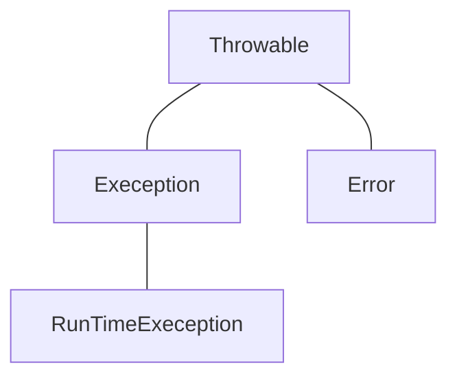

[TOC]

# 4. 异常

Java编译器可以帮我们检查出程序的语法错误。

但有一些错误，是程序可以编译，但要在运行的时候才会暴露。这时候我们就需要用到异常。

## 4.1 异常类



Java提供了所有异常的父类Throwable，只有Throwable的子孙类才是异常类。

Throw有3个重要的子孙类，Exception、Error和RuntimeException

* Error类表示错误，比如内存溢出
* Exception表示程序可能恢复的异常，其子类名均以Exception做后缀
* RuntimeException是运行时异常，是由于程序自身问题引起的，比如数组下标越界


## 4.2 异常处理机制

### 4.2.1 try-catch

常用的异常处理语句try-catch格式如下:

```java
try {
	可能出现异常的语句
}
catch(SomeException e) {	//捕捉到的异常对象 e
    处理异常
}
```

### 4.2.2 try-catch-finally

捕捉异常的完全格式如下：

```java
try {
    可能会出现异常的语句
}
catch(SomeException e) {
    处理异常
}
finally {
    异常发生，方法返回之前，总是要执行的代码
}
```

### 处理文件访问的异常

```java
try (
    定义输入输出流（可被自动关闭的对象）
){
    可能会出现异常的语句
}
catch(SomeIOException e) {
    处理异常
}
```

## 4.3 抛出异常


### 4.3.1 throws

如果某方法不知道如何处理异常，或者不想自己亲自去处理异常，则可以将本方法产生的异常抛出（throws）由上一级调用者去使用

在Java应用中如果main方法也不知道如何处理异常，也可以抛出，由JVM处理异常

throws一般写在方法名的后面


### 4.3.2 throw

除了系统自己抛出异常之外，还可以主动抛出异常

值得注意的是，throw抛出的是一个实例，所以需要通过new生成一个异常实例


### 4.3.3 异常处理的缺点

虽然异常处理让程序有更好的容错性，更加健壮，但是异常处理机制也有弊端

加入异常处理后，原本流程清晰的代码变得可读性差，可能影响程序的执行效率。


然后咱们再讲多态、反射、注解、泛型，（也就是下星期）就可以开始数据库的学习了。数据库的基本语句我会在一周讲完，之后由另外一位学长给你们讲解JDBC，也就是Java连接数据库

他讲JDBC的时候我同样尽快把JavaScript的东西全部说完，然后咱们就可以开始一些小小的练手项目了